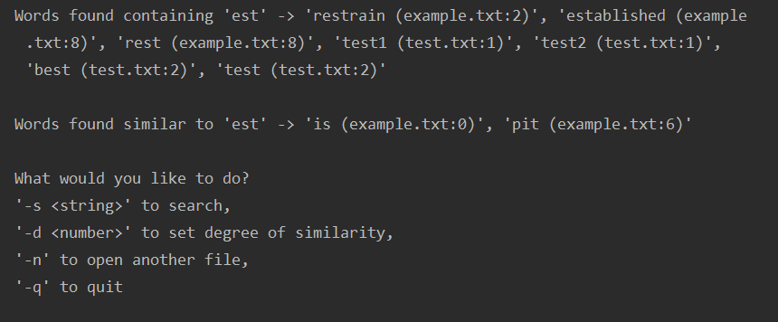

# Finderly

 A python program that scans every word in a document and lets you lookup words, providing exact & similar matches. Similar words are found using the Levenshtein distance algorithm using given degree of similarity.

### Usage
Upon initial run, type a file name to scan.

The commands available after that are:

`-s <string>` : searches for all words in every file scanned that either include `<string>` or are within the set degree of similarity (default 2).

`-d <number>` : sets the degree of similarity. Basically the edit distance, or number of characters needed to be changed to get a new word of those scanned. More info on the [Levenshtein distance algorithm](https://en.wikipedia.org/wiki/Levenshtein_distance).

`-n` : lets you add more files to scan. When multiple files are scanned, each word found with `-s` will have in parenthesis its file and line number. In the above example, the files `test.txt` and `example.txt` were scanned.
